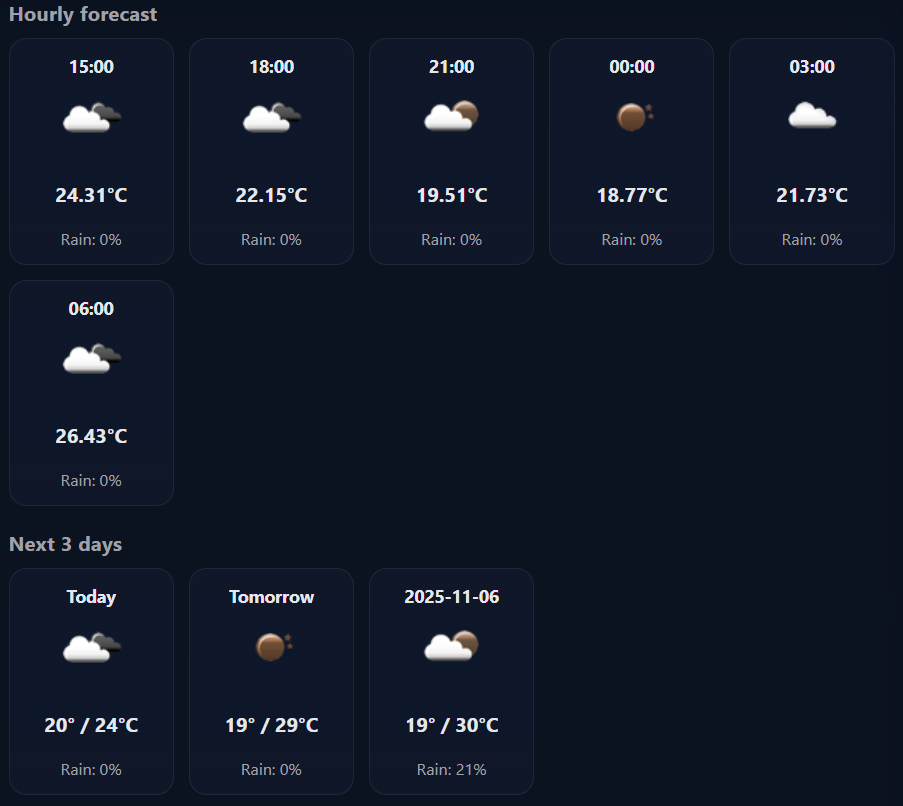
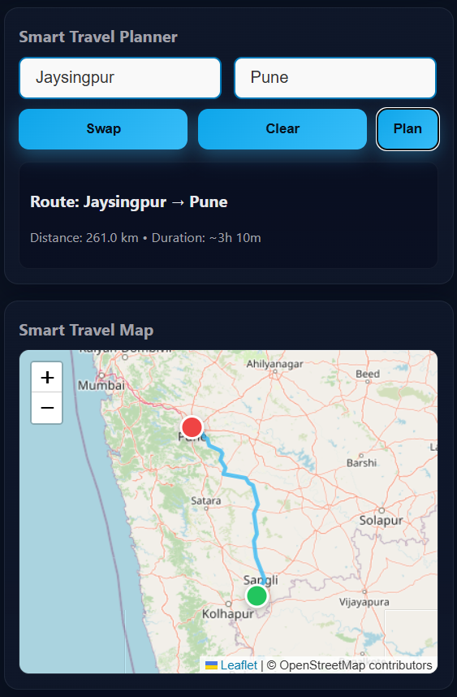
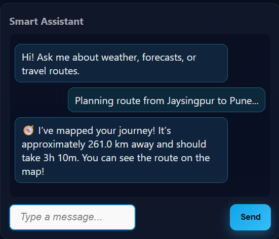

# 🌦️ Smart Weather & Travel Assistant

An intelligent **Django-based web app** that provides **real-time weather forecasts**, **smart travel planning**, and a **built-in assistant** for user-friendly interaction.  
Developed by **Aman Chougule**.

---

## 🚀 Features

✅ **Current Weather:**  
Displays temperature, humidity, “feels like,” and weather condition with icons.  

✅ **Hourly & Daily Forecast:**  
Shows next 6 hours and 3 days forecast with temperature and rain probability.  

✅ **Smart Travel Planner:**  
Lets users plan routes between two cities using OpenStreetMap with live route display.  

✅ **Smart Assistant:**  
AI-like assistant that responds to user queries about weather, rain, temperature, or routes.  

✅ **City Search & Geocoding:**  
Search any city worldwide using Nominatim API for accurate coordinates.  

✅ **Responsive Design:**  
Optimized for desktop and mobile users.

---

## 🛠️ Tech Stack

- **Backend:** Django (Python)
- **Frontend:** HTML, CSS, JavaScript
- **APIs Used:**
  - OpenWeatherMap API 🌤️
  - Nominatim (OpenStreetMap Geocoding)
  - OSRM Routing API
- **Database:** SQLite (default)
- **Environment Variables:** via `.env` file

---

## ⚙️ Setup Instructions

### 1️⃣ Clone the Repository
git clone https://github.com/amanchougule09/Smart-Weather-Travel-Planner.git
cd smart-weather-travel

2️⃣ Create a Virtual Environment
python -m venv venv
venv\Scripts\activate       # On Windows
# source venv/bin/activate  # On macOS/Linux

3️⃣ Install Dependencies

pip install -r requirements.txt
4️⃣ Set Up .env
Create a file named .env in your root directory and add:

SECRET_KEY=your_django_secret_key
DEBUG=True
ALLOWED_HOSTS=localhost,127.0.0.1
OPENWEATHER_API_KEY=your_openweather_api_key
DATABASE_URL=sqlite:///db.sqlite3

5️⃣ Run the Server
python manage.py runserver
Then visit:
👉 http://127.0.0.1:8000/

🖼️ Screenshots

### Weather Search bar

### Hourly and next 3 days forecast

### Route Planner

### Assistant

💡 Credits
Developed with ❤️ by Aman Chougule
🔗 GitHub: amanchougule09
